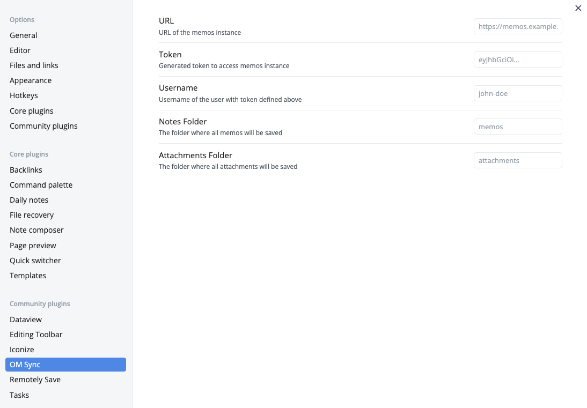

# Obsidian Memos Sync

This Obsidian plugin allows you to import memos and resources from [memos](https://usememos.com). Resources are linked to the memos in notes using a preview approach

## **Getting Started**

Install **Obsidian Memos Sync** in Obsidian → Community Plugins.

## **Settings**

1. **URL :**   Enter the url of your memos instance without any subpath. It is recommended to use HTTPS wherever possible
2. **Token :** Create a token from your memos account by navigating to `Settings` `>>` `My Account` `>>` `AccessToken`.
3. **Username :** Username of the user with above token
4. **Notes Folder :** The name of the folder where the memo notes will be save
5. **Attachments Folder :** The name of the folder where any attachments in the memos will be downloaded.

> ⚠️ Important :
> Please make sure the folder defined above exists in the vault. Otherwise the sync might fail

## **Features**

1. Simple and easier way to sync the memos as the on the go notes that lands in your vault in just one click.
2. Added a command to sync notes that can be assigned a hotkey for easier access.
3. Last sync details on the status bar.
4. Automatically takes care of the time based sync. i.e. Let's say we want to sync and then refine the notes and delete the notes. In next sync the deleted memo files will not be downloaded.
